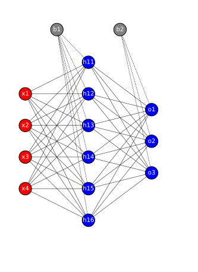

# TinyNNDiagramGenerator

[](https://fastapi.tiangolo.com/)
[](https://render.com)

This is a simple **API** that generates SVG diagrams of small feedforward neural networks. This can be used for quick visualizations, educational tools, and experimentation.

## TechStack

- code is in **Python**
- API implemented using **Fast API**
- Hosted on **Render**

## Features

- Clean SVG diagrams of neural networks
- FastAPI-based REST API
- Supports bias nodes and custom layer sizes/colors
- Useful for teaching, debugging, or creating illustrations
- Deployable in 1 click on [Render](https://render.com)

## All you need to do is :

- input the number of nodes
- input the preferred colors for those nodes in each layer

## Example Output

Here’s an example of what the API can generate:



> _(This image is generated by posting `{"layer_sizes": [4, 6, 3]}` to the API.)_

## Quickstart

```bash
# Clone and enter the project
git clone https://github.com/yourusername/TinyNNDiagramGenerator.git
cd TinyNNDiagramGenerator

# (Optional) Set up a virtual environment
python3 -m venv venv
source venv/bin/activate  # or venv\Scripts\activate on Windows

# Install dependencies
pip install -r requirements.txt

# Run the FastAPI server
uvicorn main:app --reload

# Navigate to http://127.0.0.1:8000/docs
- Click on try it out
- Paste this json below and modify your input parameters if needed
    {
    "layer_sizes": [4, 6, 3],
    "colors": ["red", "blue", "green"],
    "bias_color": "gray"
    }
-  Click on execute
-  Click on the download link in the response body to download the image as an svg.

```

## Support

Feel free to open an issue or suggest improvements via pull request.
